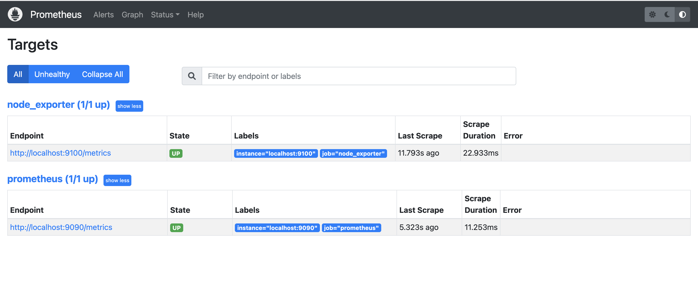
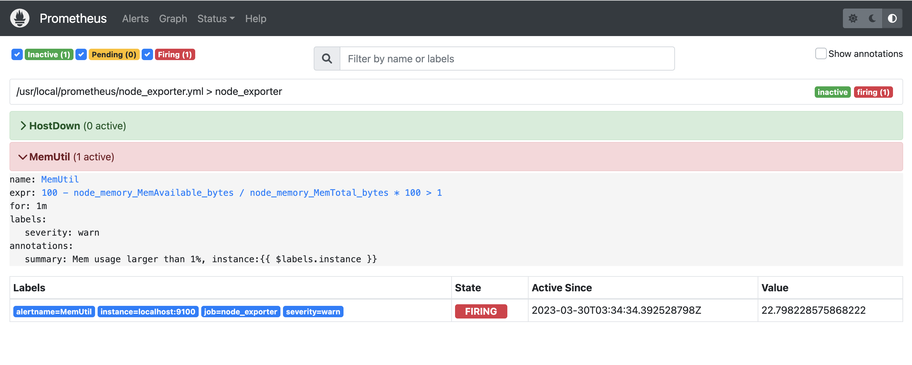
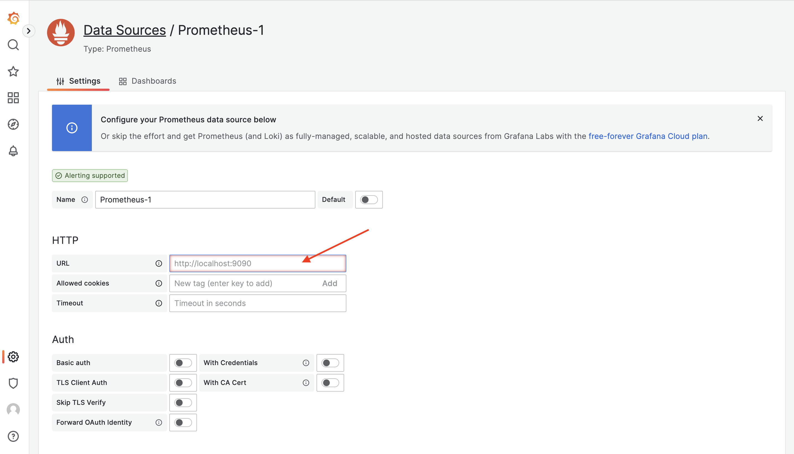
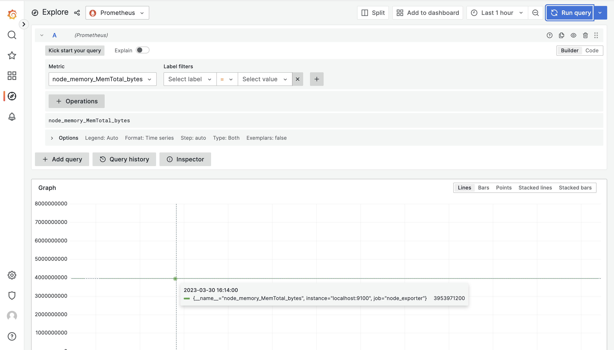

# Prometheus

### Prometheus 的下载地址

> https://prometheus.io/download/

此次演示版本如下：

prometheus 2.37.6

```
wget https://github.com/prometheus/prometheus/releases/download/v2.37.6/prometheus-2.37.6.linux-amd64.tar.gz
```

alertmanager 0.25.0

```
wget https://github.com/prometheus/alertmanager/releases/download/v0.25.0/alertmanager-0.25.0.linux-amd64.tar.gz
```

node\_exporter 1.5.0

```
wget https://github.com/prometheus/node_exporter/releases/download/v1.5.0/node_exporter-1.5.0.linux-amd64.tar.gz
```


### 部署 Prometheus

```bash
# 获取程序文件
cd /tmp

wget https://github.com/prometheus/prometheus/releases/download/v2.37.6/prometheus-2.37.6.linux-amd64.tar.gz

tar xf prometheus-2.37.6.linux-amd64.tar.gz

mkdir -p /usr/local/prometheus

cp -afr /tmp/prometheus-2.37.6.linux-amd64/* /usr/local/prometheus/

```

```bash
# 使用 systemd 托管，写入 service 文件
cat > /etc/systemd/system/prometheus.service << EOF
[Unit]
Description="prometheus"
Documentation=https://prometheus.io/
After=network.target

[Service]
Type=simple

ExecStart=/usr/local/prometheus/prometheus  --config.file=/usr/local/prometheus/prometheus.yml --storage.tsdb.path=/usr/local/prometheus/data --web.enable-lifecycle --enable-feature=remote-write-receiver --query.lookback-delta=2m --web.enable-admin-api

Restart=on-failure
SuccessExitStatus=0
LimitNOFILE=65536
StandardOutput=syslog
StandardError=syslog
SyslogIdentifier=prometheus


[Install]
WantedBy=multi-user.target
EOF

```

```bash
# 启动
systemctl enable prometheus
systemctl start prometheus
systemctl status prometheus

```

```
# 启动参数解释
--config.file=/opt/prometheus/prometheus.yml
指定 Prometheus 的配置文件路径

--storage.tsdb.path=/opt/prometheus/data
指定 Prometheus 时序数据的硬盘存储路径

--web.enable-lifecycle
启用生命周期管理相关的 API，比如调用 /-/reload 接口就需要启用该项

--enable-feature=remote-write-receiver
启用 remote write 接收数据的接口，启用该项之后，categraf、grafana-agent 等 agent 就可以通过 /api/v1/write 接口推送数据给 Prometheus 

--query.lookback-delta=2m
即时查询在查询当前最新值的时候，只要发现这个参数指定的时间段内有数据，就取最新的那个点返回，这个时间段内没数据，就不返回了 

--web.enable-admin-api
启用管理性 API，比如删除时间序列数据的 /api/v1/admin/tsdb/delete_series 接口
```

#### 访问：

> http://127.0.0.1:9090
>
> http://127.0.0.1:9090/metrics


### 部署 Node-Exporter

```bash
# 获取程序文件
cd /tmp

wget https://github.com/prometheus/node_exporter/releases/download/v1.5.0/node_exporter-1.5.0.linux-amd64.tar.gz

tar xf node_exporter-1.5.0.linux-amd64.tar.gz

mkdir -p /usr/local/node_exporter

cp -afr /tmp/node_exporter-1.5.0.linux-amd64/* /usr/local/node_exporter/

cd /usr/local/node_exporter/

# 启动
nohup ./node_exporter &> output.log &

```

#### 访问 node\_exporter

```bash
curl -s localhost:9100/metrics

```

#### 修改 Prometheus 的配置文件

```
# vim prometheus.yml
# 路径：/usr/local/prometheus/prometheus.yml

# 在 scrape_configs 下新增 job_name
scrape_configs:
  - job_name: 'node_exporter'
    static_configs:
    - targets: ['localhost:9100']
```

```bash
# 让 Prometheus 重新读取配置
kill -HUP `pidof prometheus`
```

#### 访问 Prometheus&#x20;

```
# 浏览器访问：在 Prometheus 的 Web 上（菜单位置 Status -> Targets）
http://172.20.10.11:9090/targets
```

<figure><figcaption></figcaption></figure>


### 配置告警规则

我们可以把不同类型的告警规则拆分到不同的配置文件中，然后在 prometheus.yml 中引用。比如 Node-Exporter 相关的规则，我们命名为 node\_exporter.yml，最终这个 rule\_files 就变成了如下配置。

```
# prometheus.yml
rule_files:
  - "node_exporter.yml"
```

```
# node_exporter.yml
# 监控 Node-Exporter 挂掉以及内存使用率超过 1% 这两种情况
# 这里我故意设置了一个很小的阈值，确保能够触发告警

groups:
- name: node_exporter
  rules:
  - alert: HostDown
    expr: up{job="node_exporter"} == 0
    for: 1m
    labels:
      severity: critical
    annotations:
      summary: Host down {{ $labels.instance }}
  - alert: MemUtil
    expr: 100 - node_memory_MemAvailable_bytes / node_memory_MemTotal_bytes * 100 > 1
    for: 1m
    labels:
      severity: warn
    annotations:
      summary: Mem usage larger than 1%, instance:{{ $labels.instance }}
```

```bash
# 给 Prometheus 进程发个 HUP 信号，让它重新加载配置文件
kill -HUP `pidof prometheus`

```

```
# 可以去 Prometheus 的 Web 上（Alerts 菜单）查看告警规则的判定结果
http://127.0.0.1:9090/alerts
```

<figure><figcaption></figcaption></figure>


### 部署 Alertmanager

```bash
# 获取程序文件
cd /tmp

wget https://github.com/prometheus/alertmanager/releases/download/v0.25.0/alertmanager-0.25.0.linux-amd64.tar.gz

tar xf alertmanager-0.25.0.linux-amd64.tar.gz

mkdir -p /usr/local/alertmanager

cp -afr /tmp/alertmanager-0.25.0.linux-amd64/* /usr/local/alertmanager/

```

```bash
# 使用 systemd 托管，写入 service 文件
cat > /etc/systemd/system/alertmanager.service << EOF
[Unit]
Description="alertmanager"
After=network.target

[Service]
Type=simple

ExecStart=/usr/local/alertmanager/alertmanager
WorkingDirectory=/usr/local/alertmanager

Restart=on-failure
SuccessExitStatus=0
LimitNOFILE=65536
StandardOutput=syslog
StandardError=syslog
SyslogIdentifier=alertmanager


[Install]
WantedBy=multi-user.target
EOF

```

```
# alertmanager.yml
# 配置alertmanager使用邮件告警
# 修过三处配置：
# 1、增加global（发件配置）
# 2、route里receiver修过为email
# 3、receivers里增加 - name: 'email'（收件配置）

global:
  smtp_from: 'anycing@sina.com'
  smtp_smarthost: 'smtp.sina.com:465'
  smtp_auth_username: 'anycing@sina.com'
  smtp_auth_password: 'a7c7b1c1e2c87571dz'
  smtp_require_tls: false
route:
  group_by: ['alertname']
  group_wait: 30s
  group_interval: 5m
  repeat_interval: 1h
  receiver: 'email'
receivers:
  - name: 'web.hook'
    webhook_configs:
      - url: 'http://127.0.0.1:5001/'
  - name: 'email'
    email_configs:
      - to: 'anycing@qq.com'
inhibit_rules:
  - source_match:
      severity: 'critical'
    target_match:
      severity: 'warning'
    equal: ['alertname', 'dev', 'instance']
```

```bash
# 启动服务
systemctl enable alertmanager
systemctl start alertmanager
systemctl status alertmanager

```


### 部署 Grafana

```bash
# 获取程序文件
cd /tmp

wget https://dl.grafana.com/oss/release/grafana-9.4.7.linux-amd64.tar.gz

tar xf grafana-9.4.7.linux-amd64.tar.gz

mkdir -p /usr/local/grafana

cp -afr /tmp/grafana-9.4.7/* /usr/local/grafana/

# 启动程序
nohup /usr/local/grafana/bin/grafana-server web &> grafana-server.log &

```

#### 访问

```
http://172.20.10.11:3000/

# 用户名密码：admin/admin
```

#### 添加数据源

在菜单位置：Configuration -> Data sources，点击 Add data source 就能进入数据源类型选择页面，选择 Prometheus，填写 Prometheus 的链接信息，主要是 URL，点击 Save & test 完成数据源配置。

<figure><figcaption></figcaption></figure>

<figure><figcaption></figcaption></figure>

Grafana 提供了和 Prometheus 看图页面类似的功能，叫做 Explore，我们可以在这个页面点选指标看图

<figure><figcaption></figcaption></figure>

但 Explore 功能不是最核心的，我们使用 Grafana，主要是使用 Dashboard 看图。Grafana 社区有很多人制作了各式各样的大盘，以 JSON 格式上传保存在了 [grafana.com](https://grafana.com/grafana/dashboards/)，我们想要某个 Dashboard，可以先去这个网站搜索一下，看看是否有人分享过，特别方便。因为我们已经部署了 Node-Exporter，那这里就可以直接导入 Node-Exporter 的大盘，大盘 ID 是 1860，写到图中对应的位置，点击 Load，然后选择数据源点击 Import 即可。

<figure><figcaption></figcaption></figure>
